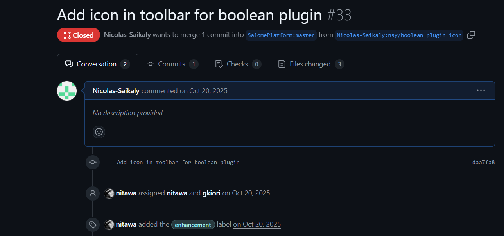
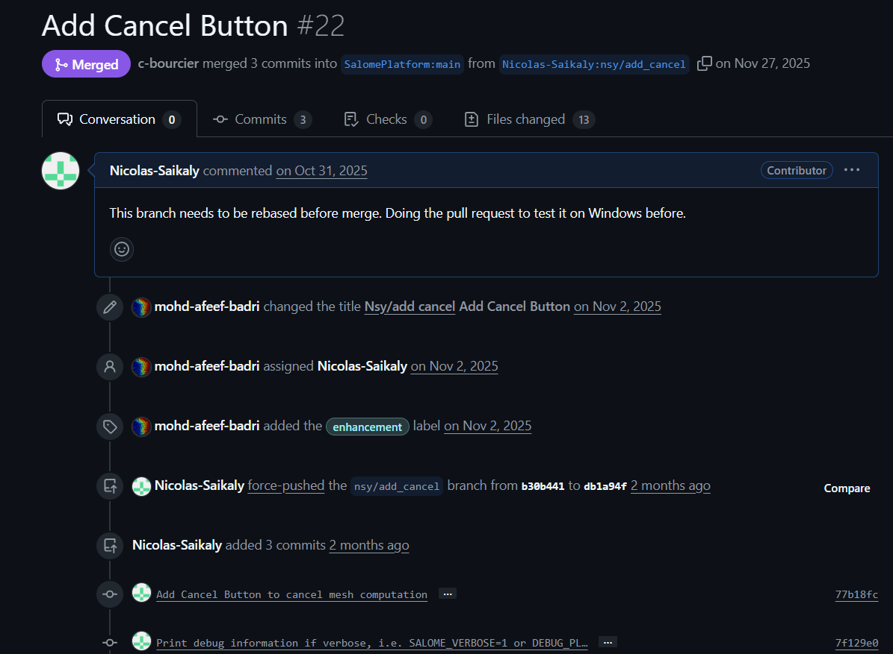
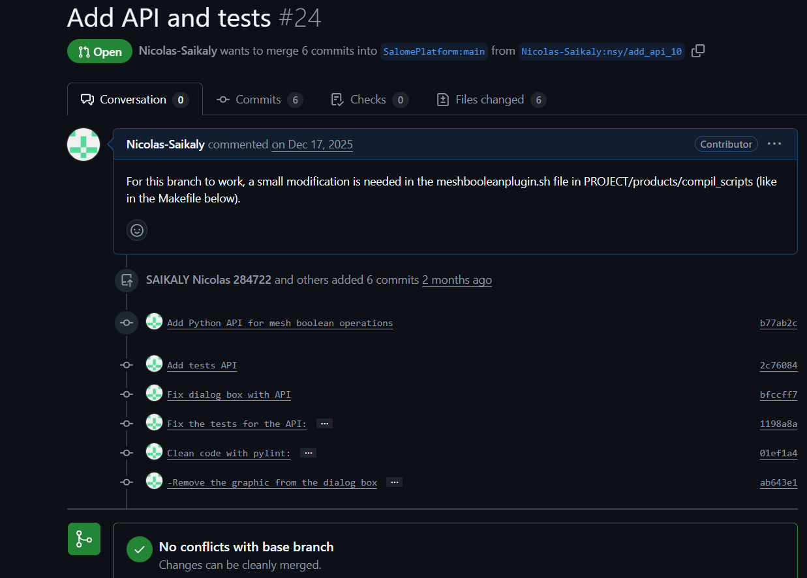
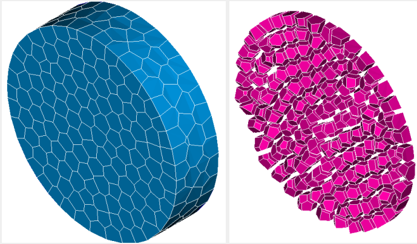
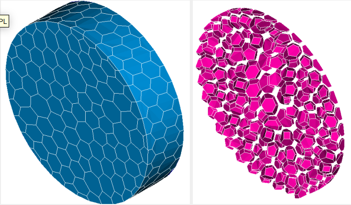
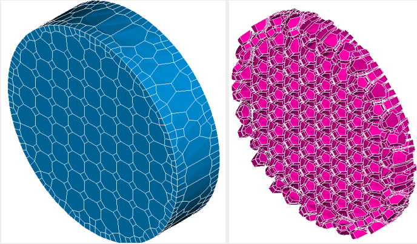

# Year 1: Apprenticeship Report (2025-2026)

## 🎯 Year 1 Objectives
The focus of this first year is the integration into the CEA environment and mastering the SALOME platform's core architecture
The experience gained year by year will help me grow into the software development engineer that I want to be

## 📅 Semester 1: Discovery & Training
*Starting from September 2025 -> January 2026*

### 📝 Key Tasks & Projects

#### 1. Onboarding & SALOME Training (First 2 weeks)
My journey began with intensive training on the various modules of the **SALOME platform**. 
This was essential to understand the software's ecosystem and adapt to its core architecture.

#### 2. Contribution to the SMESH Module: `meshbooleanplugin`
My first development assignment took place within the **SMESH** module, specifically on the **MeshBooleanPlugin** (a tool for boolean operations on meshes).

##### A. UI/UX & Cancel Button
* **UI/UX Improvement:** My first contribution was creating a dedicated logo for the plugin and integrating it into the interface to make it easily accessible for users.
  > **Pull request evidence:**
  > 
  > *Visual of the PR submitted for logo integration and UI registration.*

* **The "Cancel" Button Challenge:** My primary technical task was to implement a functionality to interrupt a boolean operation in progress.
    * **First attempt (Multiprocessing):** I initially implemented this using Python's `multiprocessing` library. While it worked perfectly on **Linux**, it failed during cross-platform testing on **Windows**.
    * **Final solution (QThread & signals):** To ensure compatibility, I pivoted to a solution using **PyQt's QThread**. By running the algorithms in a separate thread, I could "kill" the process safely when the user clicks "Cancel". This involved managing worker threads and using custom **signals** to handle the algorithm's lifecycle.
    > ⚠️ **Technical Integration Challenge (Git Rebase):** > During development, a major change occurred in the `master` branch: SALOME imports were renamed to `salome.kernel`. To maintain compatibility and ensure a clean merge, I performed an **interactive rebase**. This allowed me to synchronize my branch with the latest master changes and update the import logic across my commits before the final merge.

  > **Pull request evidence:**
  > 
  > *The PR shows the transition from multiprocessing to QThread, including commits for debug purposes.*

> This was my first significant technical achievement, solving a real-world cross-platform development issue.

##### B. Python API & refactoring
After the initial implementation, I moved toward a more professional software architecture. The goal was to decouple the logic from the interface to allow automated testing and command-line usage.

* **Development of the python API:** I created a standalone **Python API** for mesh boolean operations. 
    * **CLI support:** Operations can now be launched directly via the command line without opening the SALOME GUI.
    * **Independence:** The API is now **fully GUI-independent**, achieved by removing all imports from `mesh_boolean_dialog.py`.
    * **Logic decoupling:** The core algorithms are now separated from the UI logic.

* **Automated testing & code quality:**
    * **API tests:** Added a dedicated test suite that executes operations based on functions available in the environment.
    * **Code linting:** Used **Pylint** to clean the codebase, ensuring it follows Python PEP8 standards and is maintainable.

* **GUI optimization & cleanup:**
    * **Simplified dialog:** Refactored the dialog file by importing functions directly from the new API.
    * **UI cleanup:** Removed obsolete graphics and charts from the boolean operations dialog box that were no longer useful, resulting in a cleaner interface.

* **Build system updates (Makefile & scripts):**
    * **Makefile refactoring:** Cleaned up the UI compilation process by removing manual hacks (like `sed -i '$ d' MyPlugDialog_ui.py` and `echo "from qwt import QwtPlot" >> MyPlugDialog_ui.py`).
    * **Compil scripts:** I documented that a small modification is needed when merging in the `compil_scripts` file, following the changes made in the Makefile.

> **Pull request evidence:**
> 
> *As you can see this pull request is yet to be merged, but no conflicts with the main branch make it easier to be merged.*
> *This PR highlights the transition to a GUI-independent architecture and the removal of legacy build hacks.*


#### C. Clean temporay files : 
After adding a python API to perform boolean operations, I needed to perfect the plugin by removing all the temporary files created during the process.
For this I developed a robust management system for the temporary files generated during boolean computations (.off, .stl, .obj, .med).

* **The problem:** Previously, intermediate files were stored in `/tmp` and never deleted, consuming disk space indefinitely.
* **The solution:** I implemented a centralized logic using a **Context Manager** (`with tmpDir() as tmp_path`). This ensures that a dedicated temporary directory is created and **automatically deleted** in all scenarios:
    * Success of the operation.
    * User cancellation.
    * Any runtime error or exception.
* **GUI-independent:** I used this branch to directly move this logic into the API via the 'booleanOperation' function. The GUI now simply calls this high-level function, following the "GUI-independent" principle established earlier.

* **Error fix:** While working on this branch I also realised that there was a problem in the dialog box when an error occurs during the boolean operation. The previous error connection `self.worker.error.connect(lambda e: self.error_popup("Computation error", e))` only displayed the error message but failed to reset the UI state. This left the application in an inconsistent "computing" state.
* **Solution:** I updated the signal connection to ensure a full UI reset when a computation error occurs:
    ```python
    self.worker.error.connect(lambda e: [
        self.thread.quit(),
        setattr(self, 'computing', False),
        self.restoreCursor(),
        self.updateButton(),
        self.error_popup("Computation error", e)
    ])
    ```
  - **Result:** This ensures that the thread is stopped, the cursor is restored, and the buttons are re-enabled, providing a smooth user recovery after an error.

>Known Issue Identified: During this phase, I identified and documented a bug regarding the loading of GEOM .hdf files, which currently prevents boolean operations on this specific format until resolved.

##### D. SALOME dump study integration
I worked on integrating the plugin with the **SALOME dump study** feature, which automatically generates a Python script reflecting the user's actions in the GUI.

* **Dump optimization:** I implemented a mechanism to pause the study recording just before the file export stages. This prevents the generation of redundant or useless code lines, keeping the final Python script clean and focused on essential operations.
* **API script generation:** I added a custom logic to inject specific boolean operation commands into the dump. 
    * **The benefit:** When a user performs boolean operations via the GUI, SALOME now records them as clean API command lines.
    * **Reproducibility:** This allows users to re-run the generated Python script later to achieve the exact same results without manual interaction, effectively bridging the gap between the GUI and the python API.

> **Key achievement:** This integration ensures that the `meshbooleanplugin` follows the standard SALOME workflow, enabling power users to automate their mesh processing pipelines easily.
---

--
## 📅 Semester 2 : Advanced development
*Starting from february 2026 -> ongoing*

### 📝 Key tasks & projects

#### 1. Contribution to the SMESH module : 'polymeshplugin'
I took over the development of the **polymeshplugin**, a project initiated by a previous 5-month internship. The goal of this plugin is to transform a random mesh into a polyhedral mesh.

This plugin contains 3 C++ developed algorithms:

> **Geogram :**
> 
> 
> 
> **Polydual :**
>
> 
> 
> **Cfmesh :**
>
> 

##### A. Cross-Platform refactoring (windows compatibility)
* **The challenge :** The initial version used 'wexpect' and 'pexpect' libraries, which worked perfectly on linux but were not compatible with windows.
* **The solution :** I had to refactore the entire process management with a standard python library and did so using the **'subprocess'** module, a method I mastered during the first semester working on the meshboolean plugin. This change ensures the plugin is fully cross-platform.

##### B. Real-time progress tracking
With the change of process management, I had to make the progress bar compatible with it to improve user feedback. So I implemented the progress bar to monitor external process:
* **Buffer management :** I developed a logic to read the process output **character by character** into a buffer, this same buffer is initialized every time we encouter a space or a skip to the next line.
* **Progress mapping :** The system parses the terminal output in real-time to update the progress bar percentage as each stage of the algorithm begins

##### C. GUI responsiveness & UX enhancement
I also solved while working on this a major "freezing" issue that occured just after the process, when the '.med' file was being charged into SALOME:
* **Loading state :** I implemented a message box to inform the user that the mesh is being charged. I assured that this message appears directly after the saving file phase and after the progress bar gets to 100%. The message box keeps the user waiting and disappears directly when the mesh is ready to appear in the object browser.
* **Visual feedback :** I also added a "busy cursor" to indicate that the application is still active, preventing the user from thinking the software has crashed. Of course this goes back to normal when the message box disappears and the mesh is successfully charged.

##### D. Debug and logging
I standarized the communication between the plugin and the terminal:
* **Debug modes :** I added a proper logging system with 'verbose' and 'debug_plugin' modes, allowing developers to switch between production and detailed debug outputs easily.

> **Key achievement :** Successfuly migrated a legacy prototype into a production-ready, cross-platform tool with professional UX standard.

## 🔧 Technical skills developed
- **Software integration:** Working within a large-scale platform (SALOME).
- **GUI development:** PyQt, custom widgets, and event handling.
- **Asynchronous programming:** Managing threads (QThread) and signals.
- **Cross-platform compatibility:** Handling differences between Linux and Windows process management.
- **Backend development:** Creating GUI-independent python APIs and CLI tools.
- **DevOps & quality:** Build management (Makefile), automated testing and Pylint.
