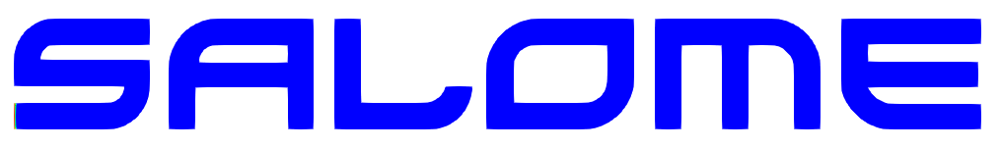

  
  &nbsp;&nbsp;&nbsp;&nbsp;&nbsp;&nbsp;&nbsp;&nbsp;&nbsp;&nbsp;&nbsp;&nbsp;&nbsp;&nbsp;&nbsp;&nbsp;&nbsp;
  
  

 

 

# Apprenticeship at CEA Paris-Saclay — SALOME platform

3-year software engineering apprenticeship at CEA Paris-Saclay (DES/ISAS/SGLS/LESIM),
combined with an engineering degree at Polytech Paris-Saclay (Software engineering & Applied Mathematics).

My work focuses on the development and modernization of meshing plugins for the
[SALOME](https://www.salome-platform.org) open-source simulation platform,
co-developed by CEA and EDF since 2000.

---

## Context

SALOME is an open-source platform for numerical simulation pre and post-processing.
It covers the full simulation workflow: CAD geometry, mesh generation, and visualization after doing solver coupling.

I worked exclusively in the **SMESH** module — the meshing module — where I developed and maintained plugins
that extend SALOME's meshing capabilities.

---

## Years

| Year | Period | Focus |
|------|--------|-------|
| [Year 1 (2025–2026)](CEA2025-2026.md) | Sep 2025 – Aug 2026 | MeshBooleanPlugin & PolyMeshPlugin |
| Year 2 (2026–2027) | Sep 2026 – Aug 2027 | Prismatic layer plugin (code_saturne) |
| Year 3 (2027–2028) | Sep 2027 – Aug 2028 | Hexahedral meshing workflow |

---

## Technical stack

| | |
|---|---|
| Languages | Python, C++, CMake |
| Frameworks | PyQt, MEDCoupling, Geogram, OpenFOAM |
| Tools | Git, GitHub, Linux (Ubuntu) |

---

## Confidentiality

This repository contains only public-facing information.
No proprietary code or sensitive CEA data is included.

---

## Contact

Nicolas SAIKALY
[LinkedIn](https://www.linkedin.com/in/nicolas-saikaly-8a787935a) · nicolas.saikaly@cea.fr
