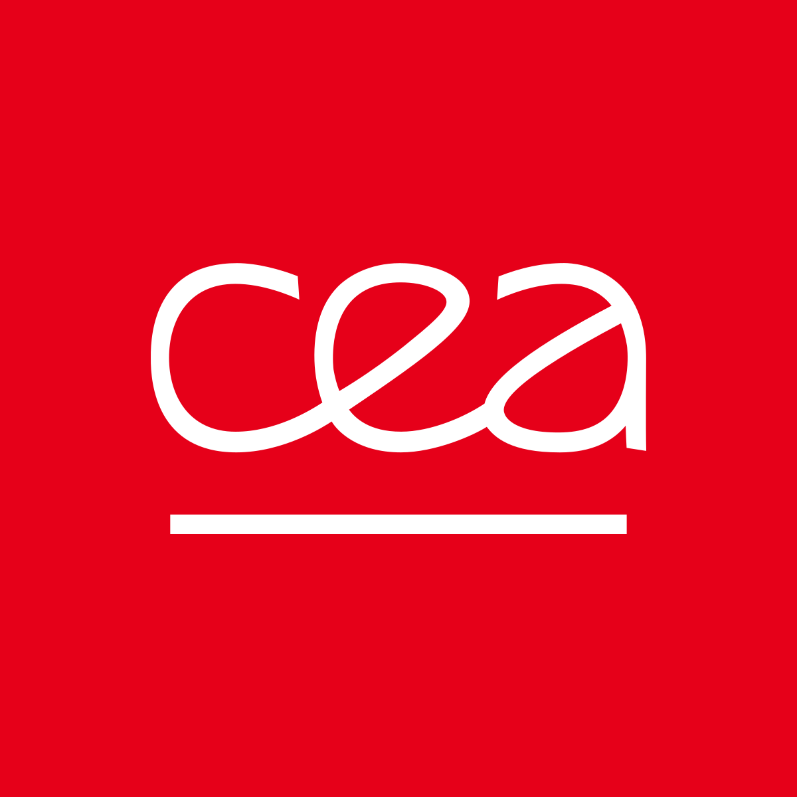
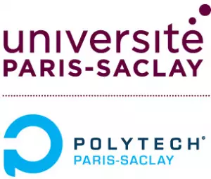

  
  

 
# 3-Year Apprenticeship at CEA Paris-Saclay | SALOME platform development

Welcome to this repository documenting my 3-year apprenticeship at CEA (Commissariat à l'énergie atomique et aux énergies alternatives)
My work focuses on the development and optimization of the SALOME platform

# 📌 Overview
* Company : CEA Paris-Saclay DES/ISAS/DM2S/SGLS/LESIM
* Role : Software engineering apprentice
* Debut : 01/09/2025
* Core technology : SALOME platform https://www.salome-platform.org/?lang=fr (Open-source integration platform )

---

## 🛠 Project context : The SALOME platform
SALOME is an open-source middleware used for pre and post processing in numerical simulation.
It provides a generic environment for:
* CAD modeling (GEOM https://docs.salome-platform.org/latest/gui/GEOM/index.html/ SHAPER https://docs.salome-platform.org/latest/gui/SHAPER/General/Introduction.html)
* MESH generation (SMESH https://docs.salome-platform.org/latest/gui/SMESH/smesh_module.html)
* Calculation scheme management
* Visualization (PARAVIS https://docs.salome-platform.org/latest/dev/PARAVIS/index.html)

## 📈 Roadmap

### Year 1 : Discovery and integration
* Training on the SALOME architecture and internal tools/modules.
* First contribution to the SMESH module using python
* First big job on a specific plugin in the SMESH module

## 📂 Detailed Documentation
* [Click here to view Year 1 Details (2025-2026)](CEA2025-2026.md)

## 💻 Technical Stack
| Category | Technologies |
| **Languages** | Python, C++, Bash |
| **Libraries** | Qt, VTK, Open CASCADE, salome |
| **Tools** | Git, CMake |
| **Environment** | Linux (Ubuntu) |

🔒 Confidentiality Notice
This repository contains a general overview of my apprenticeship and public-facing developments. Any proprietary code or sensitive data related to CEA projects are strictly excluded according to the company's security policy.

📫 Contact
Nicolas SAIKALY - www.linkedin.com/in/nicolas-saikaly-8a787935a - nicolas.saikaly@cea.fr | nicolas.saikaly@universite-paris-saclay.fr
